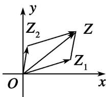
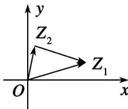

## 2. 复数加减法的几何意义

（1）复数可以用向量来表示，已知复数 $z_{1} = a + b\mathrm{i}, z_{2} = c + d\mathrm{i}$ 其对应的向量 $\overrightarrow{OZ_1} = (a,b), \overrightarrow{OZ_2} = (c,d)$ ，如图1，且 $\overrightarrow{OZ_1}$ 和 $\overrightarrow{OZ_2}$ 不共线，以 $OZ_{1}$ 和 $OZ_{2}$ 为两条邻边作平行四边形 $OZ_{1}ZZ_{2}$ ，根据向量的加法法则，对角线 $OZ$ 所对应的向量 $\overrightarrow{OZ} = \overrightarrow{OZ_1} + \overrightarrow{OZ_2}$ ，而 $\overrightarrow{OZ_1} + \overrightarrow{OZ_2}$ 所对应的坐标是 $(a + c, b + d)$ ，这正是两个复数之和 $z_{1} + z_{2}$ 所对应的有序实数对。所以 $\overrightarrow{OZ}$ 就是与复数 $z_{1} + z_{2} = (a + c) + (b + d)\mathrm{i}$ 对应的向量。

图1

图2

（2）复数的减法是加法的逆运算, 如图 2, 复数 $z_{1} - z_{2}$ 与向量 $\overrightarrow{OZ_1} - \overrightarrow{OZ_2} = \overrightarrow{Z_2Z_1}$ 对应, 这就是复数减法的几何意义.

（3）复平面内的两点间距离公式

若 $z_{1}, z_{2}$ 是复平面内的两点 $Z_{1}$ 和 $Z_{2}$ 所对应的复数，且 $z_{1} = x_{1} + y_{1}\mathrm{i}, z_{2} = x_{2} + y_{2}\mathrm{i}$ （ $x_{1}, y_{1}, x_{2}, y_{2} \in \mathbf{R}$ ），则点 $Z_{1}, Z_{2}$ 之间的距离为

$$
\left| Z _ {1} Z _ {2} \right| = \left| \overrightarrow {Z _ {1} Z _ {2}} \right| = \left| z _ {2} - z _ {1} \right| = \left| \left(x _ {2} + y _ {2} \mathrm{i}\right) - \left(x _ {1} + y _ {1} \mathrm{i}\right) \right| = \left| \left(x _ {2} - x _ {1}\right) + \left(y _ {2} - y _ {1}\right) \mathrm{i} \right| = \sqrt {\left(x _ {2} - x _ {1}\right) ^ {2} + \left(y _ {2} - y _ {1}\right) ^ {2}}.
$$

拓展:由复数加减运算的几何意义可得出: $\left\|\boldsymbol{z}_{1}\right|-\left|\boldsymbol{z}_{2}\right|\leq\left|\boldsymbol{z}_{1}\pm\boldsymbol{z}_{2}\right|\leq\left|\boldsymbol{z}_{1}\right|+\left|\boldsymbol{z}_{2}\right|$ .
