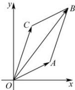

<!-- question-source:start -->
【8】（2024·高一课时练习）如图所示,在复平面内的四个点O,A,B,C恰好构成平行四边形,其中O为原点,A,B,C所对应的复数分别是 $z_{A}=4+ai$ , $z_{B}=6+8i$ , $z_{C}=a+bi$ ( $a,b\in R$ ), 则 $z_{A}-z_{C}=$ \_\_\_\_.

<!-- question-source:end -->

![[Q00008788A1]]
