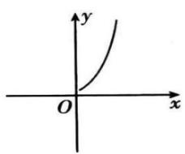
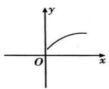
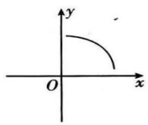
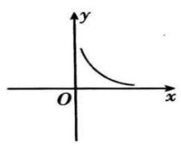

## 4. 函数变化快慢与导数的关系

一般地, 如果一个函数在某一范围内导数的绝对值较大, 那么在这个范围内函数值变化得快, 这时, 函数的图象就比较 “陡峭”（向上或向下）; 如果一个函数在某一范围内导数的绝对值较小, 那么在这个范围内函数值变化得慢, 函数的图象就 “平缓” 一些.

常见的对应情况如下表所示.

<table><tr><td>图像</td><td></td><td></td><td></td><td></td></tr><tr><td> $f'(x)$ 变化规律</td><td> $f'(x)>0$ 且越来越大</td><td> $f'(x)>0$ 且越来越小</td><td> $f'(x)<0$ 且越来越小</td><td> $f'(x)<0$ 且越来越大</td></tr><tr><td>函数值变化规律</td><td>函数值增加得越来越快</td><td>函数值增加得越来越慢</td><td>函数值减小得越来越快</td><td>函数值减小得越来越慢</td></tr></table>

5.已知函数的单调性求参数的几种类型

（1）函数 $f(x)$ 在区间 D 上单调增（单减） $\Rightarrow f'(x) \geq 0 (\leq 0)$ 在区间 D 上恒成立（验证等号是否成立）；

（2）函数 $f(x)$ 在区间 D 上存在单调增（单减）区间 $\Rightarrow f'(x) > 0 (< 0)$ 在区间 D 上能成立（即有解）；

（3）已知函数 $f(x)$ 在区间 D 内单调 $\Rightarrow f'(x)$ 不存在变号零点

（4）已知函数 $f(x)$ 在区间 D 内不单调 $\Rightarrow f'(x)$ 存在变号零点

注意:要清楚何时可以取等号,何时不取等号.
