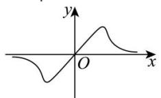
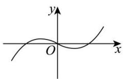
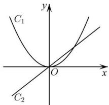
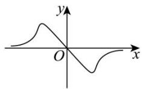
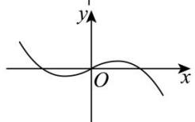
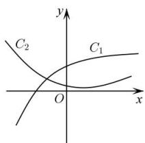
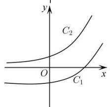
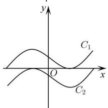

<!-- question-source:start -->
【4】设 $f'(x)$ 是函数 $f(x)$ 的导函数, 将 $y = f(x)$ 和 $y = f'(x)$ 的图象画在同一直角坐标系中, 下列不可能正确的是（）

A.

B.

A.

D.

C.

B.

C.

D.

<!-- question-source:end -->

![[Q00015840A1]]
