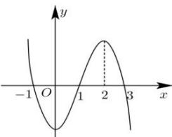

<!-- question-source:start -->
【7】设 $f'(x)$ 是函数 $f(x)$ 的导函数, $y = f(x)$ 的图像如图所示, 则 $x \cdot f'(x) > 0$ 的解集是（）

A. $(- \infty, -1) \cup (0, 1)$ B. $(-1, 0) \cup (1, 3)$ C. $(- \infty, 0) \cup (0, 2)$ D. $(0, 1) \cup (3, +\infty)$
<!-- question-source:end -->

![[Q00015843A1]]
