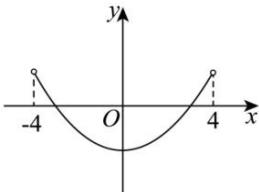

<!-- question-source:start -->
【9】（2024高三上海期中）函数 $y = f(x)$ 是定义在 $(-4, 4)$ 上的偶函数，其图像如图所示，满足 $f(3) = 0$ ，设 $y' = f'(x)$ 是 $y = f(x)$ 的导函数，则关于 x 的不等式 $f(x + 1) \cdot f'(x) \geq 0$ 的解集是 \_\_\_\_.

<!-- question-source:end -->

![[Q00015845A1]]
