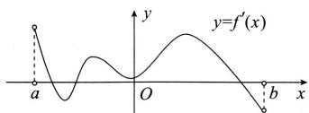

<!-- question-source:start -->
【2】函数 $f(x)$ 的定义域为 $(a,b)$ ，导函数 $f'(x)$ 在 $(a,b)$ 内的图像如图所示，则下列命题不正确的是（）

A. 函数 $f(x)$ 在 $(a, b)$ 内一定不存在最小值
B. 函数 $f(x)$ 在 $(a, b)$ 内只有一个极小值点
C. 函数 $f(x)$ 在 $(a, b)$ 内有两个极大值点
D. 函数 $f(x)$ 在 $(a, b)$ 内可能没有零点
<!-- question-source:end -->

![[Q00015913A1]]
