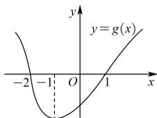

<!-- question-source:start -->
【3】设函数 $f(x)$ 在 R 上可导, 其导函数为 $f'(x)$ , 且函数 $g(x)=x \cdot f'(x)$ 的图象如图所示, 则下列结论中一定成立的是（）

A. $f(x)$ 有两个极值点 B. $f(-2)$ 为 $f(x)$ 极大值 C. $f(x)$ 有两个极小值 D. $f(-1)$ 为 $f(x)$ 极小值
<!-- question-source:end -->

![[Q00015914A1]]
