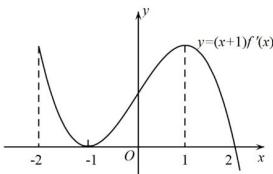

<!-- question-source:start -->
【4】函数 $f(x)$ 的导函数是 $f'(x)$ ，下图所示的是函数 $y=(x+1)\cdot f'(x)(x\in\mathbb{R})$ 的图像，下列说法正确的是（）

A. $x = -1$ 是 $f(x)$ 的零点
B. $x = 2$ 是 $f(x)$ 的极大值点
C. $f(x)$ 在区间 $(-2, -1)$ 上单调递增
D. $f(x)$ 在区间 $[-2, 2]$ 上不存在极小值
<!-- question-source:end -->

![[Q00015915A1]]
