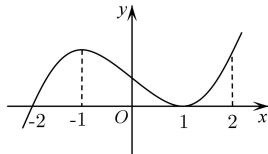

<!-- question-source:start -->
【5】如图是函数 $y = f(x)$ 的导函数 $y = f'(x)$ 的图象, 给出下列命题:

①x=-2 是函数 $y=f(x)$ 的极值点；

②x=1 是函数 $y=f(x)$ 的极值点；

③ $y = f(x)$ 的图象在 x = 0 处切线的斜率小于零；

④函数 $y = f(x)$ 在区间 $(-2, 2)$ 上单调递增.

则正确命题的序号是（）
A. ①②
B. ②④
C. ②③
D. ①④
<!-- question-source:end -->

![[Q00015916A1]]
