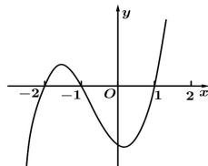

## 题型1: 求已知函数的极值

A. $f(x)$ 有极大值 $f(-1)$ 和极小值 $f(1)$ B. $f(x)$ 有极大值 $f(-2)$ 和极小值 $f(1)$ C. $f(x)$ 有极大值 $f(-1)$ 和极小值 $f(-2)$ D. $f(x)$ 有极大值 $f(-2)$ 和极小值 $f(-1)$

1. 解答本题型时应注意 $f'(x)=0$ 只是函数 $f(x)$ 在 $x_{0}$ 处有极值的必要条件, 只有再加上 $x_{0}$ 左右导数符号相反, 方能断定函数在 $x_{0}$ 处取得极值, 反映在解题上, 错误判断极值点或漏掉极值点是经常出现的失误.

![[高中/课堂同步/题库/高中数学全练一本通/导数/04_第五节_函数的极值与最值/____核心基础达标/题型1__求已知函数的极值/questions/Q00015918.md]]
