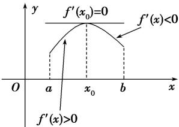
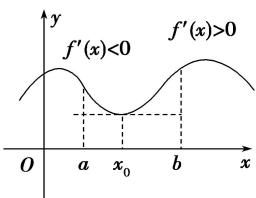

## 2. 极大值与极大值点

若函数 $y = f(x)$ 在点 x = b 的函数值 $f(b)$ 比它在点 x = b 附近其他点的函数值都大， $f'(b) = 0$ ，而且在点 x = b 附近的左侧 $f'(x) > 0$ ，右侧 $f'(x) < 0$ ，则把点 b 叫做函数 $y = f(x)$ 的极大值点， $f(a)$ 叫做函数 $y = f(x)$ 的极大值.

注意: 极小值点、极大值点统称为极值点, 极小值、极大值统称为极值.

图(1)

图(2)
