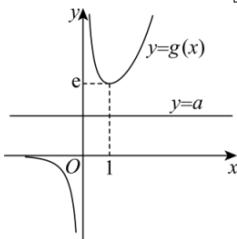

> [!faq]- 全练一本通解析
>
> > [!success]- **【答案】** [0,e)
>
> > [!note]- **【分析】**
> > 本题未单列分析。
>
> > [!note]- **【解析】**
> > $f(x)=\frac{a}{2}x^{2}-e^{x}$ 的导数为 $f'(x)=ax-e^{x}$ 由 $f(x)$ 不存在垂直于 y 轴的切线，可得 $ax-e^{x}=0$ 无实数解，
> > 显然 $x\neq0$ ，故 $a=\frac{e^{x}}{x}$ 无实根，
> > 设 $g(x)=\frac{e^{x}}{x}$ ，可得 $g'(x)=\frac{e^{x}(x-1)}{x^{2}}$ 当 x>1 时， $g'(x)>0$ ， $g(x)$ 在 $(1,+\infty)$ 单调递增；
> > 当 x<0 或 0<x<1 时， $g'(x)<0$ ， $g(x)$ 在 $(-∞,0)$ ， $(0,1)$ 单调递减。
> > 即有 $g(x)$ 在 x=1 处取得极小值，且为 e，
> > 由于直线 y=a 与 y=g(x) 图象无交点，
> > 可得 $0\leqslant a\leqslant3$ 。故答案为： $[0,a)$
> > 可得 $0 \leq a < e$ ，故答案为： $\left\lceil 0, e \right\rceil$ .
> > 
