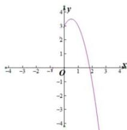

> [!faq]- 全练一本通解析
>
> > [!success]- **【答案】** $\left(\begin{matrix}3,\frac{7}{2}\end{matrix}\right)$
>
> > [!note]- **【分析】**
> > 本题未单列分析。
>
> > [!note]- **【解析】**
> > $f'(x)=2e^{2x}-2e^{x}+a$ ，依题意知 $f'(x)=3$ 有两个不同的实数解，即 $2e^{2x}-2e^{x}+a=3$ 有两个不同的实数解，
> > 即 $a=-2e^{2x}+2e^{x}+3$ 有两个不同的实数解.
> > 令 $t=e^{x}$ ，则 t>0，所以 $a=-2t^{2}+2t+3(t>0)$ 有两个不同的实数解，
> > 所以 y=a 与 $\varphi(t)=-2t^{2}+2t+3(t>0)$ 的图象有两个交点. $\varphi(t)=-2t^{2}+2t+3=-2\left(t-\frac{1}{2}\right)^{2}+\frac{7}{2}$
> > 
> > 因为 t > 0，所以 $\varphi(t)_{\max} = \varphi\left(\frac{1}{2}\right) = \frac{7}{2}$ ，又 $\varphi(0) = 3$ ，故 $3 < a < \frac{7}{2}$ ，
> > 故实数 a 的取值范围是 $\left(3, \frac{7}{2}\right)$ . 故答案为: $\left(3, \frac{7}{2}\right)$
