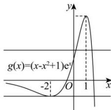

> [!faq]- 全练一本通解析
>
> > [!success]- **【答案】** $[0,e)\cup\left\{-\frac{5}{e^{2}}\right\}$
>
> > [!note]- **【分析】**
> > 本题未单列分析。
>
> > [!note]- **【解析】**
> > 设切点为 $(x_{0},x_{0}e^{x_{0}}), f'(x)=(x+1)e^{x},$ 故切线方程为 $y - x_{0}e^{x_{0}} = (x_{0} + 1)e^{x_{0}}(x - x_{0})$
> > 将 $(1,b)$ 代入切线方程得 $b-x_{0}\mathrm{e}^{x_{0}}=(x_{0}+1)\mathrm{e}^{x_{0}}(1-x_{0})$ ,
> > ∴ $b=(x_{0}-x_{0}^{2}+1)\mathrm{e}^{x_{0}}$ 过点 $(1,b)$ 作曲线 $y=xe^{x}$ 的切线有且仅有两条，
> > 则关于 $x_{0}$ 的方程 $b=(x_{0}-x_{0}^{2}+1)\mathrm{e}^{x_{0}}$ 有两解，
> > 可转化为直线 y=b 与函数 $y=(x-x^{2}+1)\mathrm{e}^{x}$ 的图象有两个交点.
> > 令 $g(x)=(x-x^{2}+1)\mathrm{e}^{x}$ ，则 $g'(x)=(2-x-x^{2})\mathrm{e}^{x}=-(x-1)(x+2)\mathrm{e}^{x}$ 当 x<-2 时， $g'(x)<0$ ， $g(x)$ 在 $(-∞,-2)$ 上单调递减；
> > 当 -2<x<1 时， $g'(x)>0$ ， $g(x)$ 在 $(-2,1)$ 上单调递增；
> > 当 x>1 时， $g'(x)<0$ ， $g(x)$ 在 $(1,+\infty)$ 上单调递减；
> > 故 $g(x)$ 的单调减区间 $(-∞,-2),(1,+∞)$ ，增区间是 $(-2,1)$ .
> > 当 $x \to -\infty$ 时， $g(x) \to 0$ ，当 $x \to +\infty$ 时， $g(x) \to -\infty$ 且 $g(1)=\mathrm{e},g(-2)=-\frac{5}{\mathrm{e}^{2}}$ 当 y=b 与 $y=g(x)$ 有且仅有两个交点时， $b\in[0,\mathrm{e})\cup\left\{-\frac{5}{\mathrm{e}^{2}}\right\}$ ，
> > 故答案为： $[0,e)\cup\left\{-\frac{5}{\mathrm{e}^{2}}\right\}$ .
> > 
