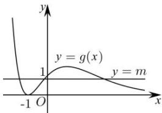

> [!faq]- 全练一本通解析
>
> > [!success]- **【答案】** B
>
> > [!note]- **【分析】**
> > 本题未单列分析。
>
> > [!note]- **【解析】**
> > 解析: 设切点为 $\left(x_{0}, \frac{x_{0}+1}{\mathrm{e}^{x_{0}}}\right)$ ，由 $f(x)=\frac{x+1}{\mathrm{e}^{x}}$ 可得 $f'(x)=\frac{\mathrm{e}^{x}-\mathrm{e}^{x}\cdot(x+1)}{\mathrm{e}^{2x}}=\frac{-x}{\mathrm{e}^{x}}$ 所以在点 $\left(x_{0}, \frac{x_{0}+1}{\mathrm{e}^{x_{0}}}\right)$ 处的切线的斜率为 $k=f'(x_{0})=\frac{-x_{0}}{\mathrm{e}^{x_{0}}}$ ，
> > 所以在点 $\left(x_{0}, \frac{x_{0}+1}{\mathrm{e}^{x_{0}}}\right)$ 处的切线为： $y-\frac{x_{0}+1}{\mathrm{e}^{x_{0}}}=\frac{-x_{0}}{\mathrm{e}^{x_{0}}}(x-x_{0})$ ，
> > 因为切线过点 $P(-1,m)$ ，所以 $m-\frac{x_{0}+1}{\mathrm{e}^{x_{0}}}=\frac{-x_{0}}{\mathrm{e}^{x_{0}}}(-1-x_{0})$ ，
> > 即 $m=\frac{(x_{0}+1)^{2}}{\mathrm{e}^{x_{0}}}$ ，即这个方程有三个不等根即可，
> > 切线的条数即为直线 y=m 与 $g(x)$ 图象交点的个数，
> > 设 $g(x)=\frac{(x+1)^{2}}{\mathrm{e}^{x}}$ ，
> > 则 $g'(x)=\frac{(2x+2)-(x^{2}+2x+1)}{\mathrm{e}^{x}}=\frac{-x^{2}+1}{\mathrm{e}^{x}}$ 由 $g'(x)>0$ 可得 -1<x<1，由 $g'(x)<0$ 可得：x<-1 或 x>1，
> > 所以 $g(x)=\frac{(x+1)^{2}}{\mathrm{e}^{x}}$ 在 $(-∞,-1)$ 和 $(1,+∞)$ 上单调递减，在 $(-1,1)$ 上单调递增，
> > 当 x 趋近于正无穷， $g(x)$ 趋近于 0，当 x 趋近于负无穷， $g(x)$ 趋近于正无穷， $g(x)$ 的图象如下图，且 $g(1)=\frac{4}{\mathrm{e}}$ ，
> > 要使 y=m 与 $g(x)=\frac{(x+1)^{2}}{\mathrm{e}^{x}}$ 的图象有三个交点，则 $0<m<\frac{4}{\mathrm{e}}$ .
> > 则 m 的取值范围是： $\left(0,\frac{4}{\mathrm{e}}\right)$ . 故选：B.
> > 
