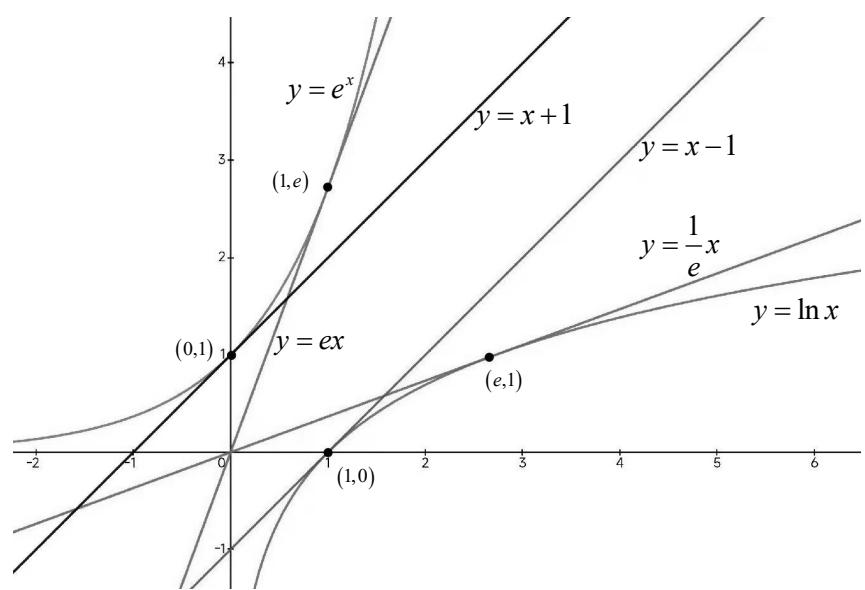

## 1. 重要的切线不等式

由图像可以分析得到:

① $e^{x}\geq1+x$ （当x=0时,等号成立）

② $e^{x} \geq ex$ （当 x = 1 时, 等号成立）

③ $\ln x \leq x - 1$ （当 x = 1 时，等号成立）

④ $\ln x \leq \frac{1}{e}x$ （当 x = e 时, 等号成立）

说明: 这 4 个不等式为切线放缩中较为重要的不等式, 尽量掌握.

2. 其他放缩不等式（作为了解即可，不必熟记）

<table><tr><td rowspan="4">对数放缩</td><td>放缩为一次函数</td><td> $\ln x \leq x - 1, \ln x < x, \ln (1 + x) \leq x$ </td></tr><tr><td>放缩为双撇函数</td><td> $\ln x < \frac{1}{2}\left(x - \frac{1}{x}\right)(x > 1), \ln x > \frac{1}{2}\left(x - \frac{1}{x}\right)(0 < x < 1),$  $\ln x < \sqrt{x} - \frac{1}{\sqrt{x}}(x > 1), \ln x > \sqrt{x} - \frac{1}{\sqrt{x}}(0 < x < 1),$ </td></tr><tr><td>放缩为二次函数</td><td> $\ln x \leq x^2 - x, \ln (1 + x) \leq x - \frac{1}{2}x^2 (-1 < x < 0), \ln (1 + x) \geq x - \frac{1}{2}x^2 (x > 0)$ </td></tr><tr><td>放缩为类反比例函数</td><td> $\ln x \geq 1 - \frac{1}{x}, \ln x > \frac{2(x - 1)}{x + 1}(x > 1), \ln x < \frac{2(x - 1)}{x + 1}(0 < x < 1),$  $\ln (1 + x) \geq \frac{x}{1 + x}, \ln (1 + x) > \frac{2x}{1 + x}(x > 0), \ln (1 + x) < \frac{2x}{1 + x}(x < 0)$ </td></tr><tr><td rowspan="3">指数放缩</td><td>放缩成一次函数</td><td> $e^x \geq x + 1, e^x > x, e^x \geq ex$ </td></tr><tr><td>放缩成类反比例函数</td><td> $e^x \leq \frac{1}{1 - x}(x \leq 0), e^x < -\frac{1}{x}(x < 0)$ </td></tr><tr><td>放缩成二次函数</td><td> $e^x \geq 1 + x + \frac{1}{2}x^2 (x > 0), e^x \geq 1 + x + \frac{1}{2}x^2 + \frac{1}{6}x^3$ </td></tr><tr><td colspan="2">三角函数放缩</td><td> $\sin x < x < \tan x (x > 0), \sin x \geq x - \frac{1}{2}x^2, 1 - \frac{1}{2}x^2 \leq \cos x \leq 1 - \frac{1}{2}\sin^2 x.$ </td></tr><tr><td colspan="2">以直线 y = x - 1 为切线的函数</td><td> $y = \ln x, y = e^{x-1} - 1, y = x^2 - x, y = 1 - \frac{1}{x}, y = x\ln x.$ </td></tr></table>

说明:对于上述表格内的放缩不等式,略作了解即可,不必完全掌握,针对较为复杂的放缩类型,并不是高考考察的内容,并且在解答题中,选择何种放缩类型,也基本都会在前一问中给提示,所以不必熟记.重要的是要学会放缩这种解题技巧和方法.
