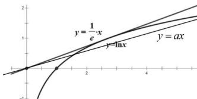

> [!faq]- 全练一本通解析
>
> > [!success]- **【答案】** $(e, +\infty)$
>
> > [!note]- **【分析】**
> > 本题未单列分析。
>
> > [!note]- **【解析】**
> > 切线法：即 $y = ax$ 与 $y = \ln x$ 有2个交点， $\because x > 0$ 时， $\ln x \leq \frac{1}{e} x$ ，结合图象得 $0 < a < \frac{1}{e}$ ， $\therefore a > e$ 。
> > 
