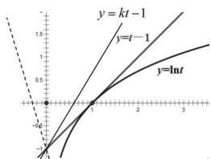

> [!faq]- 全练一本通解析
>
> > [!success]- **【答案】** $\left[1,+\infty\right)$
>
> > [!note]- **【分析】**
> > 本题未单列分析。
>
> > [!note]- **【解析】**
> > 切线法：
> > $\because \forall x > 1, \ln (x - 1) - k(x - 1) + 1 \leq 0$ 恒成立，
> > 令 $t = x - 1$ ，
> > 即 $\forall t > 0, \ln t - kt + 1 \leq 0$ 恒成立，
> > 即 $\forall t > 0, \ln t \leq kt - 1$ 恒成立，
> > 即 $y = \ln t$ 在 $y = kt - 1$ 图象下方， $\because t > 0$ 时 $\ln t \leq t - 1$ $\therefore$ 结合图像得 $k \geq 1$ ：
> > 
