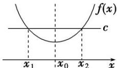
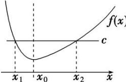
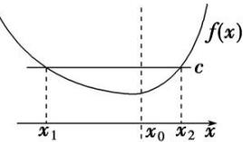

## 1. 极值点偏移的概念

已知函数 $y = f(x)$ 是连续函数, 在区间 $(a, b)$ 内只有一个极值点 $x_0$ , $f(x_1) = f(x_2)$ , 且 $x_0$ 在 $x_1$ 与 $x_2$ 之间, 若 $f(x) = c$ 的两根的中点刚好满足 $\frac{x_1 + x_2}{2} = x_0$ , 即极值点在两根的正中间, 也就是说极值点没有偏移. 此时函数 $f(x)$ 在 $x = x_0$ 两侧, 函数值变化快慢相同, 如图（1）.

图(1)

(无偏移，左右对称，二次函数)若 $f(x_{1})=f(x_{2})$ ，则 $x_{1}+x_{2}=2x_{0}$ .

若 $f(x) = c$ 的两根中点 $\frac{x_1 + x_2}{2} \neq x_0$ ，则极值点偏移，此时函数 $f(x)$ 在 $x = x_0$ 两侧，函数值变化快慢不同，如图（2）、图（3）.

图(2)

(左陡右缓，极值点向左偏移)若 $f(x_{1})=f(x_{2})$ ，则 $x_{1}+x_{2}>2x_{0}$ .

图(3)

(左缓右陡，极值点向右偏移)若 $f(x_{1})=f(x_{2})$ ，则 $x_{1}+x_{2}<2x_{0}$ .
