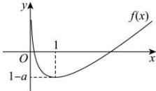

> [!faq]- 全练一本通解析
>
> > [!success]- **【答案】** （1） $(1, + \infty)$ （2）证明见详解
>
> > [!note]- **【分析】**
> > 本题未单列分析。
>
> > [!note]- **【解析】**
> > （1） $f(x)$ 的定义域为 $(0,+\infty)$ ,
> > 因为 $f'(x)=1-\frac{1}{x}=\frac{x-1}{x}$ ，所以当 0<x<1 时， $f'(x)<0$ ，当 x>1
> > 时， $f'(x)>0$ 所以 $f(x)$ 在 $(0,1)$ 上单调递减，在 $(1,+\infty)$ 上单调递增，
> > 所以当 x=1 时， $f(x)$ 取得最小值 1-a.
> > 又当 x 趋近于 0 或 $+\infty$ 时， $f(x)$ 趋于 $+\infty$ ，
> > 所以，要使 $f(x)$ 有两个不同的零点 $x_{1}, x_{2}$ ，只需满足 1-a<0，即 a>1。
> > 所以实数 a 的取值范围为 $(1,+\infty)$ .
> > 
> > （2）不妨设 $x_{1}<x_{2}$ ，由（1）可知， $0<x_{1}<1,x_{2}>1$ ，则 $2-x_{1}>1$ ，
> > 要证 $x_{1}+x_{2}>2$ ，只需证 $2-x_{1}<x_{2}$ ，
> > 又 $f(x)$ 在 $(1,+\infty)$ 上单调递增，所以只需证 $f(2-x_{1})<f(x_{2})$ ，即证 $f(2-x_{1})<f(x_{1})$ .
> > 记 $g(x)=f(2-x)-f(x)=2-2x-\ln(2-x)+\ln x,x\in(0,1)$ 则 $g'(x)=\frac{1}{x}+\frac{1}{2-x}-2=-\frac{2(x-1)^{2}}{x(x-2)}$ 当 0<x<1 时， $g'(x)>0$ ， $g(x)$ 单调递增，
> > 又 $g(1)=f(2-1)-f(1)=0$ 所以 $g(x_{1})=f(2-x_{1})-f(x_{1})<0$ ，即 $f(2-x_{1})<f(x_{1})$ 。所以 $x_{1}+x_{2}>2$ 。
