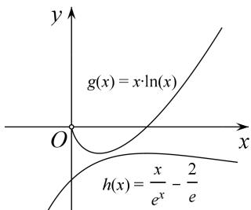

## 3. 指对在一起, 常常要分离

设 $f(x)$ 为可导函数, 则有 $\left(\mathrm{e}^{x}\ln x - f(x)\right)^{\prime} = \mathrm{e}^{x}\ln x + \frac{\mathrm{e}^{x}}{x} - f(x)$ , 若 $f(x)$ 为非常数函数, 求导式子中还是含有 $e^{x}, \ln x$ , 针对此类型, 可以采用作商的方法, 构造 $\frac{\mathrm{e}^{x}\ln x - f(x)}{\mathrm{e}^{x}} = \ln x - \frac{f(x)}{\mathrm{e}^{x}}$ , 从而达到简化证明和求极值、最值的目的, $\mathrm{e}^{x}\ln x$ 腻在一起, 常常会分离.

【经典例题】设函数 $f(x) = ae^{x}\ln x + \frac{be^{x - 1}}{x}$ ，曲线 $y = f(x)$ 在点(1, $f(1)$ )处的切线为 $y = e(x - 1) + 2$

(1) 求 a, b;

(2) 证明: $f(x) > 1$ .

【详解】（1） $f'(x)=ae^{x}\left(\ln x+\frac{1}{x}\right)+\frac{be^{x-1}(x-1)}{x^{2}}(x>0)$ ，由于直线 $y=e(x-1)+2$ 的斜率为e，图象过点 $(1,2)$ ，
所以 $\left\{\begin{aligned}f(1)&=2,\\ f'(1)&=e,\end{aligned}\right.$ 即 $\left\{\begin{aligned}b&=2,\\ ae&=e,\end{aligned}\right.$ 解得 $\left\{\begin{aligned}a&=1,\\ b&=2.\end{aligned}\right.$

（2）由（1）知 $f(x) = \mathrm{e}^{x}\ln x + \frac{2\mathrm{e}^{x - 1}}{x} (x > 0)$ ，从而 $f(x) > 1$ 等价于 $x\ln x > x\mathrm{e}^{-x} - \frac{2}{\mathrm{e}}.$

构造函数 $g(x)=x\ln x$ ，则 $g'(x)=1+\ln x$ ，

所以当 $x \in \left(0, \frac{1}{\mathfrak{e}}\right)$ 时， $g'(x) < 0$ ，当 $x \in \left(\frac{1}{\mathfrak{e}}, +\infty\right)$ 时， $g'(x) > 0$ ，

故 $g(x)$ 在 $\left(0, \frac{1}{\mathbf{e}}\right)$ 上单调递减，在 $\left(\frac{1}{\mathbf{e}}, +\infty\right)$ 上单调递增，从而 $g(x)$ 在 $(0, +\infty)$ 上的最小值为 $g\left(\frac{1}{\mathbf{e}}\right) = -\frac{1}{\mathbf{e}}$ 构造函数 $h(x) = x\mathrm{e}^{-x} - \frac{2}{\mathbf{e}}$ 则 $h'(x) = \mathrm{e}^{-x}(1 - x)$ .

所以当 $x \in (0,1)$ 时， $h'(x) > 0$ ；当 $x \in (1, +\infty)$ 时， $h'(x) < 0$ ；

故 $h(x)$ 在 $(0,1)$ 上单调递增，在 $(1, +\infty)$ 上单调递减，从而 $h(x)$ 在 $(0, +\infty)$ 上的最大值为 $h(1) = -\frac{1}{e}$ . 综上，当 $x > 0$ 时， $g(x) > h(x)$ ，即 $f(x) > 1$ .

