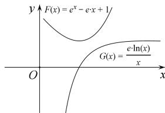

> [!faq]- 全练一本通解析
>
> > [!success]- **【答案】** 详见解析
>
> > [!note]- **【分析】**
> > 本题未单列分析。
>
> > [!note]- **【解析】**
> > （1） $f(x) = \frac{1}{x} + a\ln x, x \in (0, +\infty).f'(x) = -\frac{1}{x^2} + \frac{a}{x} = \frac{ax - 1}{x^2}$ 当 $a \leqslant 0$ 时， $f(x) < 0$ ，函数 $f(x)$ 在 $x \in (0, +\infty)$ 上单调递减。
> > 当 $a > 0$ 时，由 $f'(x) < 0$ ，得 $0 < x < \frac{1}{a}$ ，由 $f(x) > 0$ ，得 $x > \frac{1}{a}$ ，
> > 所以函数 $f(x)$ 在 $\left(0, \frac{1}{a}\right)$ 上单调递减，在 $\left(\frac{1}{a}, +\infty\right)$ 上单调递增.
> > （2） $a = 1$ 时，要证 $f(x) + g(x) - \left(1 + \frac{\mathrm{e}}{x^2}\right)\ln x > \mathrm{e}$ . 即要证 $\frac{1}{x} + \frac{\mathrm{e}^x}{x} - \frac{\mathrm{e}}{x^2}\ln x - \mathrm{e} > 0 \Leftrightarrow \mathrm{e}^x - \mathrm{e}x + 1 > \frac{\mathrm{e}\ln x}{x}, x \in (0, +\infty)$ .
> > 令 $F(x) = \mathrm{e}^x - \mathrm{e}x + 1, F'(x) = \mathrm{e}^x - \mathrm{e}$ ，
> > 当 $x \in (0,1)$ 时， $F'(x) < 0$ ，此时函数 $F(x)$ 单调递减；
> > 当 $x \in (1, +\infty)$ 时， $F'(x) > 0$ ，此时函数 $F(x)$ 单调递增.
> > 可得当 $x = 1$ 时，函数 $F(x)$ 取得最小值 $F(1) = 1$ .
> > 令 $G(x) = \frac{\mathrm{e}\ln x}{x}, G'(x) = \frac{\mathrm{e}(1 - \ln x)}{x^2}$ ，
> > 当 $0 < x < e$ 时， $G'(x) > 0$ ，此时 $G(x)$ 为增函数，当 $x > e$ 时， $G'(x) < 0$ ，此时 $G(x)$ 为减函数，所以 $x = e$ 时函数 $G(x)$ 取得最大值 $G(e) = 1$ . $x = 1$ 与 $x = e$ 不同时取得，因此 $F(x) > G(x)$ ，即 $\mathrm{e}^x - \mathrm{e}x + 1 > \frac{\mathrm{e}\ln x}{x}, x \in (0, +\infty)$ . 故原不等式成立.
> > 
