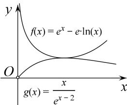

> [!faq]- 全练一本通解析
>
> > [!success]- **【答案】** 详见解析
>
> > [!note]- **【分析】**
> > 本题未单列分析。
>
> > [!note]- **【解析】**
> > （1）当 a=e 时， $f(x)=e^{x}-e\ln x-e, f'(x)=e^{x}-\frac{e}{x}, f'(1)=0$ . $f''(x)=e^{x}+\frac{e}{x^{2}}>0,\therefore f'(x)$ 在 $(0,+\infty)$ 单调递增. $\therefore x\in(0,1)$ 时， $f'(x)<f'(1)=0,x\in(1,+\infty),f'(x)>f'(1)=0$ $\therefore f(x)$ 在 $(0,1)$ 单调递减，在 $(1,+\infty)$ 单调递增. $\therefore f(x)$ 的极小值为 $f(1)=0$ ，无极大值.
> > （2）由（1）得 $e^{x}-e\ln x-e\geq0\Rightarrow e^{x}-e\ln x\geq e$ ，所证不等式： $e^{2x-2}-e^{x-1}\ln x-x\geq0\Leftrightarrow e^{x}-e\ln x\geq\frac{x}{e^{x-2}}$ .
> > 设 $g(x)=\frac{x}{e^{x-2}}=xe^{2-x},g'(x)=e^{2-x}-xe^{2-x}=(1-x)e^{2-x}$ ，令 $g'(x)>0$ 可解得：x<1.
> > ∴ $g(x)$ 在 $(0,1)$ 单调递增，在 $(1,+\infty)$ 单调递减. ∴ $g(x)_{\max}=g(1)=e$ .
> > ∴ $e^{x}-e\ln x\geq e\geq g(x)$ ，即 $e^{x}-e\ln x\geq\frac{x}{e^{x-2}},\therefore e^{2x-2}-e^{x-1}\ln x-x\geq0$
> > 
