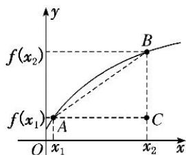
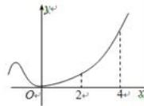
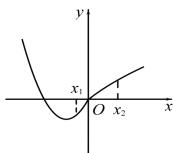
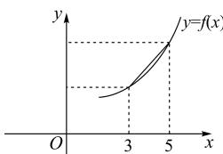
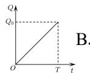
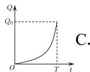
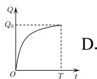
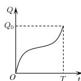

<!-- source-part:1 pages:1-95 -->

高中数学选择性必修二

# 【全练一本通】

一元函数的导数及其应用

## 目录

<<练基础>>
【基础点1】求物体的平均与瞬时速度....2
【基础点2】函数的平均与瞬时变化率....2
【基础点3】对导数定义概念的理解....3
【基础点4】对导数定义概念的理解....3
[角度1] 求函数在某点处的导数
[角度2] 求函数的导函数
<<练重点>>
【题型1】函数的切线方程问题....4
[角度1] 求“过”与“在”一点的切线方程
[角度2] 利用导数求切点坐标
【题型2】导数几何意义的应用....5
第二节 导数的运算
<<练基础>>
【基础点1】根据公式与法则求导函数....7
【基础点2】求复合函数的导数....8
<<练重点>>
【题型1】利用公式求导数值....9
【题型2】函数的切线方程问题....9
【题型3】利用相切关系求最小距离....10
第三节 导数与函数的单调性
<<练重点>>
【题型1】原函数与导函数图像的关系....12
【题型2】求具体函数的单调区间....13
【题型3】讨论含参函数的单调性....15
【题型4】已知单调性求参数....16
【题型5】利用函数单调性解不等式....17
[角度1] 直接利用函数单调奇偶性解不等式
[角度2] 构造新函数解不等式
【题型6】构造函数比较大小....18
第四节 专题:分类讨论单调性专练
<<练重点>>
【题型1】导函数为一次型....20
【题型2】导函数为二次可分解型....21
【题型3】导函数为二次不可分解型....23
【题型4】导函数为其他类型....23
第五节 函数的极值与最值
<<练基础>>
【基础点1】极值的相关概念....26
【基础点2】导函数图像与极值的关系....26
<<练重点>>

【题型1】求已知函数的极值....27
【题型2】讨论含参数的函数的极值....28
【题型3】已知函数极值求参数....29
【题型4】求已知函数的最值....31
【题型5】讨论含参数的函数的最值....31
【题型6】求已知函数的最值求参数....32
【题型7】利用最值证明不等式....33
[方法1]构造函数法
[方法2]最值比较法
[方法3]等价转化法

第六节 专题:函数的切线问题题型总结
【题型1】“在”与“过”某点的切线方程问题....36
[角度1]求切线方程
[角度2]根据切线方程求参数
【题型2】切线方程的存在性问题....37
【题型3】切线的条数问题....37
【题型4】公切线问题....38

第七节 专题:导函数与原函数的奇偶周期性
<<练重点>>....39

第八节 专题:利用导函数构造原函数
<<练重点>>
【类型1】利用函数求导法则构造函数....43
【类型2】构造之幂函数模型....43
【类型3】构造之指数函数模型....44
【类型4】构造之三角函数模型....45
<<练提升>>....46

第九节 专题:利用导数研究恒成立（能成立）问题
<<练重点>>
【题型1】单变量的恒成立有解问题....51
[方法1]分离参数法
[方法2]等价转化法
【题型2】双变量的恒成立与有解问题....55

第十节 专题:导数中的隐零点问题
<<练重点>>....60

第十一节 专题:导数的切线放缩问题
<<练重点>>
【题型1】切线法的应用....64
【题型2】放缩法的应用....64

第十二节 专题:导数的同构问题
<<练重点>>
【类型1】双变量轮换式构造....70
【类型2】指对混合同构....71

第十三节 专题:极值点偏移问题

【方法1】对称化构造函数....76
【方法2】比值或差值代换....77
【方法3】对数平均不等式....78
<<练重点>>....79

第十四节 专题:必要性探路与端点效应

<<练重点>>
【类型1】必要性探路....84
【类型2】端点效应....84

第十五节 专题:指对数化简求导技巧

<<练重点>>
【类型1】与指数有关的化简求导....89
【类型2】与对数有关的化简求导....89
【类型3】综合例题....90

# 第一节 导数的概念及其意义

## 知识导学

## 一. 变化率问题

## 1. 物体的平均速度与瞬时速度

(1) 平均速度

设物体的运动规律是 $s = s(t)$ ，则物体在 $t_0$ 到 $t_0 + \Delta t$ 这段时间内的平均速度为 $\frac{\Delta s}{\Delta t} = \frac{s(t_0 + \Delta t) - s(t_0)}{\Delta t}$

(2) 瞬时速度

①物体在某一时刻的速度称为瞬时速度；

②一般地, 当 $\Delta t$ 无限趋近于 0 时, $\frac{\Delta s}{\Delta t}$ 无限趋近于某一个常数 v, 我们就说当 $\Delta t$ 趋近于 0 时, $\frac{\Delta s}{\Delta t}$ 的极限就是 v, 这时 v 就是物体在 $t = t_{0}$ 时的瞬时速度,

即瞬时速度可表示为 $v=\lim_{\Delta t\to0}\frac{\Delta s}{\Delta t}=\lim_{\Delta t\to0}\frac{s(t_{0}+\Delta t)-s(t_{0})}{\Delta t}$

## 2. 函数的切线与斜率

（1）函数的切线（以抛物线 $f(x)=x^{2}$ 为例）

与研究瞬时速度类似, 我们可在 $f(x)=x^{2}$ 上取一点 $P_{0}(1,1)$ ，并在 $P_{0}$ 点附近任取一点 $P(x,x^{2})$ ，我们发现，当点 P 无限趋近于点 $P_{0}$ 时，割线 $P_{0}P$ 无限趋近于一个确定的位置，

这个确定位置的直线称为抛物线 $f(x)=x^{2}$ 在点 $P_{0}$ 处的切线.

（2）函数切线的斜率（以抛物线 $f(x)=x^{2}$ 为例）

我们将 P 点的坐标设为 $\left(1+\Delta x, \left(1+\Delta x\right)^{2}\right)$ . 于是割线 $P_{0}P$ 的斜率 $k=\frac{\left(1+\Delta x\right)^{2}-1^{2}}{1+\Delta x-1}=\Delta x+2$ 我们发现，当 $\Delta x$ 无限趋近于 0 时，即无论 x 从小于 1 的一边，还是从大于 1 的一边无限趋近于 1 时，割线 $P_{0}P$ 的斜率 k 都无限趋近于 2.
我们把 2 叫做 “当 $\Delta x$ 无限趋于 0 时， $k=\frac{f(1+\Delta x)-f(1)}{\Delta x}$ 的极限” 记为 $\lim_{\Delta x\to0}\frac{f(1+\Delta x)-f(1)}{\Delta x}=2$ 因此，函数 $f(x)=x^{2}$ 在 $P_{0}(1,1)$ 处切线的斜率为 2.

## 二. 导数的概念与几何意义

## 1. 函数的平均变化率

（1）定义：对于函数 $y = f(x)$ ，设自变量 $x$ 从 $x_0$ 变化到 $x_0 + \Delta x$ ，相应地，函数值 $y$ 就从 $f(x_0)$ 变化到 $f(x_0 + \Delta x)$ 。这时， $x$ 的变化量为 $\Delta x, y$ 的变化量为 $\Delta y = f(x_0 + \Delta x) - f(x_0)$ 。我们把比值 $\frac{\Delta y}{\Delta x}$ ，即 $\frac{\Delta y}{\Delta x} = \frac{f(x_0 + \Delta x) - f(x_0)}{\Delta x}$ 叫做函数 $y = f(x)$ 从 $x_0$ 到 $x_0 + \Delta x$ 的平均变化率。

(2) 平均变化率的几何意义:

设 $A(x_{1},f(x_{1}))$ ， $B(x_{2},f(x_{2}))$ 是曲线 $y = f(x)$ 上任意不同的两点，

函数 $y = f(x)$ 的平均变化率 $\frac{\Delta y}{\Delta x} = \frac{f(x_2) - f(x_1)}{x_2 - x_1} = \frac{f(x_1 + \Delta x) - f(x_1)}{\Delta x}$ 为割线 $AB$ 的斜率，如图.

## 2. 函数的导数（瞬时变化率）

当 $\Delta x \to 0$ 时，平均变化率 $\frac{\Delta y}{\Delta x}$ 无限趋近于一个确定的值，即 $\frac{\Delta y}{\Delta x}$ 有极限，则称 $y = f(x)$ 在 $x = x_{0}$ 处可导，并把这个确定的值叫做 $y = f(x)$ 在 $x = x_{0}$ 处的导数（也称瞬时变化率），记作 $f'(x_{0})$ 或 $y'\big|_{x=x_{0}}$ ，即 $f'(x_{0}) = \lim_{\Delta x \to 0} \frac{\Delta y}{\Delta x} = \lim_{\Delta x \to 0} \frac{f(x_{0} + \Delta x) - f(x_{0})}{\Delta x}$ .

注意：（1） $x_{0}+\Delta x$ 是 $x_{0}$ 附近的任意一点， $\Delta x$ 可正可负，但不能为 0.

3. 导数的变形
① $\lim_{x\to x_{0}}\frac{f(x_{0}-\Delta x)-f(x_{0})}{-\Delta x}=f'(x_{0})$ ② $\lim_{x\to x_{0}}\frac{f(x)-f(x_{0})}{x-x_{0}}=f'(x_{0})$ .
③ $\lim_{\Delta x\to0}\frac{f(x_0+m\Delta x)-f(x_0)}{m\Delta x}=f'(x_0)$ ,
④ $\lim_{h\to0}\frac{f(x_0+h)-f(x_0-h)}{2h}=f'(x_0)$ .

函数 $y = f(x)$ 在 $x = x_0$ 处的导数 $f'(x_0)$ 是在点 $P(x_0, f(x_0))$ 处的切线的斜率 $k$ ，即 $k = f'(x_0) = y' \bigg|_{x = x_0}$ ，

## 5. “函数 $y = f(x)$ 在 $x = x_0$ 的导数”“导函数”“导数”三者之间的区别与联系

“函数 $y = f(x)$ 在 $x = x_{0}$ 处的导数”是一个数值, 针对 $x_{0}$ 而言的, 与给定的函数及 $x_{0}$ 的位置有关, 与 $\Delta x$ 无关; “导函数”简称为“导数”, 如果对于函数 $y = f(x)$ 在开区间 $(a, b)$ 内每一个确定的值 $x_{0}$ , 都对应着一个导数 $f'(x_{0})$ , 这样就在开区间 $(a, b)$ 内构成一个新的函数, 我们把这一新函数叫做 $y = f(x)$ 在区间 $(a, b)$ 内的导函数, 记作 $f'(x)$ 或 $y'$ .

## ▶ ▷ 核心基础达标

## ▶基础点 1: 求物体的平均与瞬时速度

【1】某质点沿曲线运动的方程为 $f(x) = -x^{2} + 3$ （x 表示时间， $f(x)$ 表示位移），则该质点从 x = 2 到 x = 3 的平均速度为（）

A. -5    B. 5    C. -6    D. 6

【2】一个物体做直线运动,位移 s（单位: m）与时间 t （单位: s）之间的函数关系为 $s(t) = 6t^{2} + mt$ ，且这一物体在 $1 \leq t \leq 2$ 这段时间内的平均速度为 20m/s，则实数 m 的值为（）
A. 2 B. 1 C. -1 D. -2

【3】物体的位移 x 与时间 t 的关系为 $x(t)=t^{2}+1$ ，则物体在 $[2,2+\Delta t]$ 这段时间内的平均速度为（）
A. $2 + \Delta t$ B. $4 + \Delta t$ C. $4 + \Delta t + \frac{1}{\Delta t}$ D. $4 + (\Delta t)^{2}$

【4】一物体做直线运动, 其位移 y （单位: m ）与时间 t （单位: s ）的关系是 $y = -t^{2} + 9t$ ，则该物体在 t = 3s 时的瞬时速度为（）
A. 3 B. 6 C. 12 D. 16

【5】已知一物体的运动方程是 $S = 24t - 3t^{2}$ (S 的单位为 m, t 的单位为 s)，则该物体在时间段 [0,6] 内的平均速度与 t 时刻的瞬时速度相等，则 t = \_\_\_\_ s.

## ▶基础点 2: 函数的平均与瞬时变化率

【6】(2023·全国高二例题)已知函数 $f(x)=3x+2$ , $g(x)=x^{2}$ ，分别计算它们在区间 $[-2,-1]$ ， $[1,5]$ 上的平均变化率.

【7】已知函数 $f(x)=2x^{2}-4$ 的图象上一点 $(1,-2)$ 及附近一点 $(1+\Delta x, -2+\Delta y)$ ，则 $\frac{\Delta y}{\Delta x}==(\quad)$ A. 4 B. 4x
C. $4 + 2\Delta x$ D. $4 + 2(\Delta x)^{2}$

【8】若函数 $f(x)=x^{2}-m^{2}$ 在区间 $[2,t]$ 上的平均变化率为 5，则 t 等于（）
A. $\sqrt{5}$ B. 2 C. 3 D. 1

【9】设 $f(x)=x^{3}-8x$ ，则 $\lim_{\Delta x\to0}\frac{f(2+\Delta x)-f(2)}{\Delta x}=()$ A.-4 B.-8 C.4 D.8

【10】已知 $f(x) = \frac{1}{x}$ ，则 $\lim_{\Delta x \to 0} \frac{f(1 + \Delta x) - f(1)}{\Delta x} =$ \_\_\_\_.

## ▶基础点 3: 对导数定义概念的理解

【11】已知函数 $f(x)$ 在 $x = x_{0}$ 处的导数为 -2，则 $\lim_{k\to0}\frac{f(x_{0}+k)-f(x_{0})}{k}$ 等于（）
A. -2 B. -1 C. 2 D. 1

【12】（2024·全国高二例题）若函数 $f(x)$ 在 $x = x_{0}$ 处可导，则 $\lim_{h \to 0} \frac{f(x_{0} + h) - f(x_{0})}{h}$ 的结果（）.
A. 与 $x_{0}$ ，h 均无关
B. 仅与 $x_{0}$ 有关，而与 h 无关
C. 仅与 h 有关，而与 $x_{0}$ 无关
D. 与 $x_{0}$ ，h 均有关

【13】已知 $\lim_{\Delta x\to0}\frac{f(1)-f(1+\Delta x)}{\Delta x}=3$ ，则 $f(x)$ 在 x=1 处的导数 $f'(1)=$ （） A.-1 B.1 C.-3 D.3【14】若函数 $y = f(x)$ 在 $x = x_{0}$ 处的导数为 1，则 $\lim_{\Delta x\to0}\frac{f(x_{0}+2\Delta x)-f(x_{0}-\Delta x)}{\Delta x}=()$ A. 2 B. 3 C. -2 D. -3

【15】（2024·全国高二例题）已知 $f'(x_{0})=2$ ，则 $\lim_{\Delta x\to0}\frac{f(x_{0}-\Delta x)-f(x_{0})}{2\Delta x}=$ \_\_\_\_.

【16】（2024·全国高二例题）设 $f(x)$ 在 $x = x_{0}$ 处可导，则 $\lim_{h \to 0} \frac{f(x_{0} + h) - f(x_{0} - h)}{2h} = (\quad)$ .
A. $2f'(x_{0})$ B. $\frac{1}{2}f'(x_{0})$ C. $f'(x_{0})$ D. $4f'(x_{0})$

【17】已知 $\lim_{\Delta x\to0}\frac{f(-2+\Delta x)-f(-2-\Delta x)}{\Delta x}=-2$ ，则 $f^{\prime}(-2)=$ （）
A. 1 B. -1 C. 2 D. -2

## ▶基础点 4: 求函数的导数

## $\triangleright$ 角度1:求函数在某点处的导数

【18】（22-23 高二·全国·课后作业）利用导数的定义求函数 $f(x)=3x^{2}-2x$ 在 x=1 处的导数.

【19】求函数 $y=\sqrt{x}$ 在 x=1 处的导数.

【20】设函数 $f(x)=ax+1$ ，若 $f'(1)=2$ ，则 $a=(\quad)$ A. 2 B. -2 C. 3 D. -3

【21】已知函数 $f(x)$ 在 x=1 处的导数为 3，则函数 $f(x)$ 的解析式可能为（）

A. $f(x)=3(x-1)$ B. $f(x)=2(x-1)$ C. $f(x)=2x-1$ D. $f(x)=x-1$

【22】已知函数 $y = f(x) = 2x^{2} + 1$ 在 $x = x_{0}$ 处的瞬时变化率为 -8，则 $f(x_{0}) =$ \_\_\_\_.

【23】对于函数 $y=f(x)=\frac{1}{x^{2}}$ ，其导数值等于函数值的点是 \_\_\_\_.

【24】已知函数 $f(x)=x^{2}$ 与函数 $g(x)=x^{3}$ ，则满足 $f'(x_{0})+2=g'(x_{0})$ 的正数 $x_{0}$ 的值为 \_\_\_\_.

## $\triangleright$ 角度2:求函数的导函数

【25】利用导数定义求下列各函数的导数：

(1) $y = 2x + 3$ ;

(2) $y = x^{2} - 3x$ ;

(3) $y = \frac{2}{x} + 2$

(4) $y=\frac{1}{x}+3x$ .

## 重点题型专练

## 题型1: 函数的切线方程问题

## $\triangleright$ 角度1:求“过”与“在”一点的切线方程

（1）当已知点是切点时, 直接利用导数求切线的斜率, 写出直线方程.

（2）当已知点不是切点时, 设出切点, 利用导数表示出切线斜率, 写出切线方程, 代入已知点的坐标, 求出切点坐标, 写出直线方程.

【26】(2024·全国高二)已知曲线方程为 $y = x^{2}$ ，求：

（1）点 $A(2,4)$ 处的切线方程

(2) 过点 $B(3,5)$ 且与曲线相切的直线方程.

【27】（2021高二·全国·课后）已知函数 $f(x) = x^{3}$ .

（1）求函数 $f(x)$ 的图象在点 $(1,1)$ 处的切线方程；

（2）若函数 $f(x)$ 的图象为曲线 C，过点 $P\left(\frac{2}{3},0\right)$ 作曲线 C 的切线，求切线的方程.

【28】计算抛物线 $y = x^{2} - 4x + 3$ 上任一点 $P(u, v)$ 处的切线的斜率，并求过点 $(3, 0)$ 的切线方程.

【29】求函数 $f(x)=x^{3}-3x^{2}+x$ 的图象上过原点的切线方程.

【30】（23-24 高二下·北京·期中）已知直线 $l_{1}$ 为曲线 $y = x^{2} + x - 2$ 在点 $(0, -2)$ 处的切线， $l_{2}$ 为该曲线的另一条切线，且 $l_{1} \perp l_{2}$ .

（1）利用导数定义求函数 $y = x^{2} + x - 2$ 的导数；

(2) 求直线 $l_{1}$ 、 $l_{2}$ 的方程.

## $\triangleright$ 角度2：利用导数求切点坐标

$$
\left(x _ {0}, y _ {0}\right)
$$

(2) 求导函数 $f'(x)$ ;

$$
f ^ {\prime} \left(x _ {0}\right)
$$

（4）由斜率的关系列出关于 $x_{0}$ 的方程解 $x_{0}$ ;

$$
x _ {0} \text {代入} y = f (x)
$$

$$
y _ {0}
$$

【31】在曲线 $y=\frac{4}{x^{2}}$ 上求一点 P，使得曲线在点 P 处的切线分别满足下列条件：

（1）平行于直线 $y = x + 1$ ;

(2) 垂直于直线 $2x - 16y + 1 = 0$ ;

（3）倾斜角为 $135^{\circ}$ .

【32】曲线 $y = f(x) = \frac{1}{x}$ 在点 P 处的切线与直线 $y = \frac{1}{4}x$ 垂直，则点 P 的坐标为 \_\_\_\_.

【33】（2024·全国高二）已知直线 $y=4x+a(a<0)$ 和曲线 $y=x^{3}-2x^{2}+3$ 相切，则切点坐标为 \_\_\_\_，实数 a 的值为 \_\_\_\_.

## 题型 2: 导数几何意义的应用

【34】已知函数 $f(x)$ 在 R 上可导, 其图象如图所示, 设 $\frac{f(4)-f(2)}{4-2}=a$ , 则下列不等式正确的是（）

A. $a <   f^{\prime}(2) <   f^{\prime}(4)$ B. $f^{\prime}(2) <   a <   f^{\prime}(4)$ C. $f^{\prime}(4) <   f^{\prime}(2) <   a$ D. $f^{\prime}(2) <   f^{\prime}(4) <   a$

【35】已知函数 $f(x)$ 的图象如下所示, $f'(x)$ 为 $f(x)$ 的导函数, 根据图象判断下列正确的是（）

A. $f^{\prime}(x_{1}) <   f^{\prime}(x_{2})$ B. $f^{\prime}(x_1) > f^{\prime}(x_{2})$ C. $f(x_{1}) <   f^{\prime}(x_{2}) <   0$ D. $f(x_{1}) > f^{\prime}(x_{2}) > 0$

【36】函数 $y = f(x)$ 的图象如图所示, $f'(x)$ 是函数 $f(x)$ 的导函数, 则下列数值排序正确的是（）

A. $2f^{\prime}(3) < f(5) - f(3) < 2f^{\prime}(5)$ B. $2f^{\prime}(3) < 2f^{\prime}(5) < f(5) - f(3)$ C. $f(5) - f(3) < 2f^{\prime}(3) < 2f^{\prime}(5)$ D. $2f^{\prime}(3) < 2f^{\prime}(5) < f(5) - f(3)$

【37】(多选)近两年为抑制房价过快上涨,政府出台了一系列以“限购、限外、限贷、限价”为主题的房地产调控政策.各地房产部门为尽快实现稳定房价,提出多种方案,其中之一就是在规定的时间T内完成房产供应量任务Q.已知房产供应量Q与时间t的函数关系如图所示,则在以下四种房产供应方案中,在时间[0,T]内供应效率（单位时间的供应量）不逐步提高的是（）

A.

![[高中/课堂同步/题库/高中数学全练一本通/导数/01_第二节_导数的运算/01_第二节_导数的运算.md]]
![[高中/课堂同步/题库/高中数学全练一本通/导数/02_第三节_导数与函数的单调性/02_第三节_导数与函数的单调性.md]]
![[高中/课堂同步/题库/高中数学全练一本通/导数/03_第四节_专题__分类讨论单调性专练/03_第四节_专题__分类讨论单调性专练.md]]
![[高中/课堂同步/题库/高中数学全练一本通/导数/04_第五节_函数的极值与最值/04_第五节_函数的极值与最值.md]]
![[高中/课堂同步/题库/高中数学全练一本通/导数/05_第六节_专题__函数的切线问题题型总结/05_第六节_专题__函数的切线问题题型总结.md]]
![[高中/课堂同步/题库/高中数学全练一本通/导数/06_第七节_专题__导函数与原函数的奇偶周期性/06_第七节_专题__导函数与原函数的奇偶周期性.md]]
![[高中/课堂同步/题库/高中数学全练一本通/导数/07_第八节_专题__利用导函数构造原函数/07_第八节_专题__利用导函数构造原函数.md]]
![[高中/课堂同步/题库/高中数学全练一本通/导数/08_第九节_专题_利用导数研究恒成立_能成立_问题/08_第九节_专题_利用导数研究恒成立_能成立_问题.md]]
![[高中/课堂同步/题库/高中数学全练一本通/导数/09_第十节_专题__导数中的隐零点问题/09_第十节_专题__导数中的隐零点问题.md]]
![[高中/课堂同步/题库/高中数学全练一本通/导数/10_第十一节_专题__导数的切线放缩问题/10_第十一节_专题__导数的切线放缩问题.md]]
![[高中/课堂同步/题库/高中数学全练一本通/导数/11_第十二节_专题__导数的同构问题/11_第十二节_专题__导数的同构问题.md]]
![[高中/课堂同步/题库/高中数学全练一本通/导数/12_第十三节_专题_极值点偏移问题/12_第十三节_专题_极值点偏移问题.md]]
![[高中/课堂同步/题库/高中数学全练一本通/导数/13_第十四节_专题_必要性探路与端点效应/13_第十四节_专题_必要性探路与端点效应.md]]
![[高中/课堂同步/题库/高中数学全练一本通/导数/14_第十五节_专题__指对数化简求导技巧/14_第十五节_专题__指对数化简求导技巧.md]]
