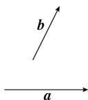
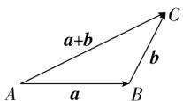
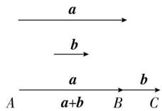
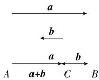
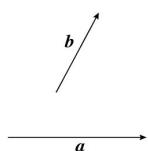
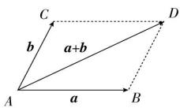

## 2. 向量加法的三角形法则

如图, 已知非零向量 a, b , 在平面内任取一点 A , 作 $\overrightarrow{AB} = a, \overrightarrow{BC} = b$ , 则向量 $\overrightarrow{AC}$ 叫做 a 与 b 的和, 记作 $a + b$

即 $a + b = \overrightarrow{AB} + \overrightarrow{BC} = \overrightarrow{AC}$ ，这种求向量和的方法称为向量加法的三角形法则.

简记为:首尾顺次连接,指向终点.

当 a 与 b 共线时, 求它们的和可用如图表示.

注意:零向量与任一向量a的和都有 $a+0=0+a=a$ .

3. 向量加法的平行四边形法则

如图, 以同一点 O 为起点的两个已知向量 a, b, 以 OA, OB 为邻边作 □OACB, 则以 O 为起点的向量 $\overrightarrow{OC}$ (OC 是 □OACB 的对角线) 就是向量 a 与 b 的和, 这种作两个向量和的方法叫做向量加法的平行四边形法则.

注意: 向量 “共起点” 作平行四边形

4. 多向量相加

为了得到有限个向量的和, 只需将这些向量通过平移后依次首尾相接, 那么以第一个向量的起点为起点, 最后一个向量的终点为终点的向量, 就是这些向量的和. 即: $\overrightarrow{A_{1}A_{2}} + \overrightarrow{A_{2}A_{3}} + \cdots + \overrightarrow{A_{n-1}A_{n}} = \overrightarrow{A_{1}A_{n}}$

5. 向量加法的三角形不等式:

向量 a, b 的模与 $a + b$ 的模之间满足不等式 $\left|\left|a\right| - \left|b\right|\right| \leq \left|a + b\right| \leq \left|a\right| + \left|b\right|$ .

当向量 a 与 b 同向时, 右侧等号成立, 当向量 a 与 b 反向时, 左侧等号成立.

6. 向量加法的运算律:

交换律: $a + b = b + a$ .

结合律: $(a+b)+c=a+(b+c)$ .
