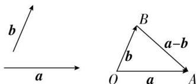

## 三. 向量的减法运算

1. 相反向量

与 a 长度相等、方向相反的向量, 叫做 a 的相反向量, 记作 -a.

2. 性质：

(1) -0 = 0 ; (2) $-(-a) = 0$ ; (3) $a + (-a) = (-a) + a = 0$ ;

（4）若 a 与 b 互为相反向量，则 a = -b, b = -a, $b + a = 0$ .

注意:相反向量与相等向量一样,从“长度”和“方向”两方面进行定义,相反向量必为平行向量.

3. 向量的减法

（1）定义： $a-b=a+(-b)$ ，即减去一个向量相当于加上这个向量的相反向量.

（2）减法的三角形法则：如图，已知非零向量 $a, b$ ，在平面内任取一点 $O$ ，作 $\overrightarrow{OA} = a, \overrightarrow{OB} = b$ ，连接 $BA$ ，则 $\overrightarrow{BA} = \overrightarrow{OA} - \overrightarrow{OB} = a - b$ 。即把两个向量 $a, b$ 的起点放在一起，则两个向量的差 $a - b$ 是以减向量 $b$ 的终点为起点，被减向量 $a$ 的终点为终点的向量，这是向量减法的三角形法则，即向量减法的几何意义。

