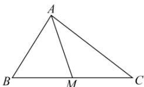

> [!faq]- 全练一本通解析
> **【答案】** C
>
> **【解析】**
> 解析: 因为 M 是线段 BC 的中点, 所以 $\overrightarrow{AB} + \overrightarrow{AC} = 2\overrightarrow{AM}$ ,
> 又 $\overrightarrow{AB}-\overrightarrow{AC}=\overrightarrow{CB},\left|\overrightarrow{BC}\right|=4$ 所以 $2\left|\overrightarrow{AM}\right|=\left|\overrightarrow{AB}+\overrightarrow{AC}\right|=\left|\overrightarrow{AB}-\overrightarrow{AC}\right|=\left|\overrightarrow{CB}\right|=4$ 所以 $\left|\overrightarrow{AM}\right|=2$ . 故选：C
> 
