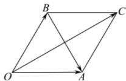

> [!faq]- 全练一本通解析
> **【答案】** $\frac{\pi}{6}$
>
> **【解析】**
> 设 $\overrightarrow{OA} = \overrightarrow{a}$ , $\overrightarrow{OB} = \overrightarrow{b}$ , 以 OA, OB 为邻边作平行四边形 OACB, 如图所示,
> 
> 则有 $\overrightarrow{BA}=\vec{a}-\vec{b}$ ， $\overrightarrow{OC}=\vec{a}+\vec{b}$ ，
> 由 $\left|\vec{a}\right|=\left|\vec{b}\right|=\left|\vec{a}-\vec{b}\right|$ ，则四边形 OACB 为菱形， $\angle BOA=\frac{\pi}{3}$
> 则有 $\vec{a}$ 与 $\vec{a}+\vec{b}$ 的夹角为 $\angle COA=\frac{\pi}{6}$ .
