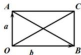
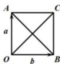

> [!faq]- 全练一本通解析
> **【答案】** （1）4；（2） $\sqrt{2}$ 。
>
> **【解析】**
> （1）设 $\overrightarrow{OA} = \vec{a}$ ， $\overrightarrow{OB} = \vec{b}$ ，则 $|\overrightarrow{BA}| = |\vec{a} - \vec{b}|$ ，以 OA 与 OB 边邻边作平行四边形 OACB，如图（1），
> 则 $|\overrightarrow{OC}| = |\vec{a} + \vec{b}|$ .
> 由于 $(\sqrt{7} + 1)^{2} + (\sqrt{7} - 1)^{2} = 4^{2}$ ，
> 即 $|\overrightarrow{OA}|^{2} + |\overrightarrow{OB}|^{2} = |\overrightarrow{BA}|^{2}$ ，
> 所以 $\triangle OAB$ 是以 $\angle AOB$ 为直角的直角三角形，从而 $\overrightarrow{OA} \perp \overrightarrow{OB}$ ，所以平行四边形 OACB 是矩形.
> $$
> | \overrightarrow {O C} | = | \overrightarrow {B A} | = 4
> $$
> $$
> 1 8 0 ^ {\circ}
> $$
> 
> 
> (2)
> (1)
> （2）设 $\overrightarrow{OA} = \overrightarrow{a}$ ， $\overrightarrow{OB} = \overrightarrow{b}$ ，以 OA 与 OB 为邻边作平行四边形 OACB，
> 如图（2）因为 $|\vec{a}| = |\vec{b}|$ ，所以平行四边形 $OACB$ 为菱形。又 $|\overrightarrow{BA}| = |\vec{a} - \vec{b}| = \sqrt{2}$ ， $|\vec{a}| = |\vec{b}| = 1$ ，则 $\overrightarrow{OA} \perp \overrightarrow{OB}$ ，所以菱形 $OACB$ 是正方形，所以 $|\vec{a} + \vec{b}| = |\overrightarrow{OC}| = |\overrightarrow{BA}|$ ，所以 $|\vec{a} + \vec{b}| = \sqrt{2}$ 。
