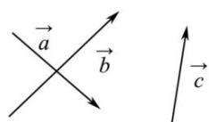
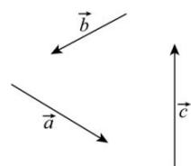

<!-- question-source:start -->
【17】(2021·全国)如图, 已知向量 $\vec{a}, \vec{b}, \vec{c}$ 不共线.
（1）作向量 $\vec{a} + \vec{b} + \vec{c}$ ; （2）作向量 $\vec{a} - \vec{b} - \vec{c}$ .

<!-- question-source:end -->

![[Q00009113A1]]
