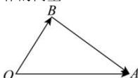
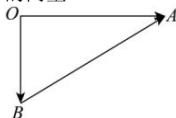
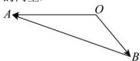

> [!faq]- 全练一本通解析
> **【答案】** 答案见解析
>
> **【解析】**
> （1）作 $\overrightarrow{OA} = \vec{a}$ ， $\overrightarrow{OB} = \vec{b}$ ，则 $\vec{a} - \vec{b} = \overrightarrow{OA} - \overrightarrow{OB} = \overrightarrow{BA}$ ，即 $\overrightarrow{BA}$ 即为所求作的向量.
> 
> （2）解：作 $\overrightarrow{OA} = \vec{a}$ ， $\overrightarrow{OB} = \vec{b}$ ，则 $\vec{a} - \vec{b} = \overrightarrow{OA} - \overrightarrow{OB} = \overrightarrow{BA}$ ，即 $\overrightarrow{BA}$ 即为所求作的向量.
> 
> （3）解：作 $\overrightarrow{OA} = \vec{a}$ ， $\overrightarrow{OB} = \vec{b}$ ，则 $\vec{a} - \vec{b} = \overrightarrow{OA} - \overrightarrow{OB} = \overrightarrow{BA}$ ，即 $\overrightarrow{BA}$ 即为所求作的向量.
> 
> （4）解：作 $\overrightarrow{OA} = \overrightarrow{a}$ ， $\overrightarrow{OB} = \overrightarrow{b}$ ，则 $\overrightarrow{a} - \overrightarrow{b} = \overrightarrow{OA} - \overrightarrow{OB} = \overrightarrow{BA}$ ，即 $\overrightarrow{BA}$ 即为所求作的向量.
