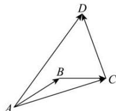
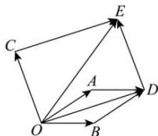

> [!faq]- 全练一本通解析
> **【答案】** 详见解析
>
> **【解析】**
> A←O→B
> $$
> \overrightarrow {A B} = \overrightarrow {a}, \overrightarrow {B C} = \overrightarrow {b}
> $$
> $$
> \overrightarrow {A C} = \vec {a} + \vec {b}
> $$
> $$
> \overrightarrow {C D} = \vec {c}
> $$
> $$
> \overrightarrow {A D} = \overrightarrow {A C} + \overrightarrow {C D} = (\vec {a} + \vec {b}) + \vec {c}
> $$
> $$
> \overrightarrow {A D} = \vec {a} + \vec {b} + \vec {c}
> $$
> 
> 解法二：（平行四边形法则）因为向量 $\vec{a},\vec{b},\vec{c}$ 不共线，如下图所示，在平面内任取一点 $O$ ，作 $\overrightarrow{OA} = \overrightarrow{a}$ ， $\overrightarrow{OB} = \overrightarrow{b}$ 以 $\overrightarrow{OA}$ ， $\overrightarrow{OB}$ 为邻边作平行四边形 $OADB$ ，则对角线 $\overrightarrow{OD} = \overrightarrow{a} +\overrightarrow{b}$ 再作 $\overrightarrow{OC} = \overrightarrow{c}$ ，以 $\overrightarrow{OC}$ ， $\overrightarrow{OD}$ 为邻边作平行四边形 $OCED$ ，则 $\overrightarrow{OE} = \overrightarrow{a} +\overrightarrow{b} +\overrightarrow{c}$
> 
