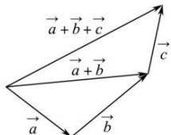
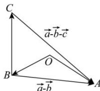

> [!faq]- 全练一本通解析
> **【答案】** 答案见详解.
>
> **【解析】**
> （1）由向量加法的三角形法则， $\vec{a}+\vec{b}+\vec{c}$ 如图，
> 
> （2）如图，作 $\overrightarrow{OA} = \vec{a}, \overrightarrow{OB} = \vec{b}$ ，则 $\overrightarrow{BA}$ 即为 $\vec{a} - \vec{b}$ ，再作 $\overrightarrow{BC} = \vec{c}$ ，则向量 $\overrightarrow{CA}$ 即为 $\vec{a} - \vec{b} - \vec{c}$ 。
> 
