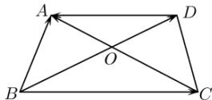

<!-- question-source:start -->
【19】如图, 在梯形 $ABCD$ 中, $AD \parallel BC$ , $AC$ 与 $BD$ 交于点 $O$ , 化简 $\overrightarrow{BA} - \overrightarrow{BC} - \overrightarrow{OA} + \overrightarrow{OD} + \overrightarrow{DA}$ .

<!-- question-source:end -->

![[Q00009115A1]]
