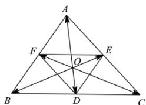

<!-- question-source:start -->
【22】（2019·高一课时练习）如图所示，已知 $\overrightarrow{OA}=\overrightarrow{a},\overrightarrow{OB}=\overrightarrow{b},\overrightarrow{OC}=\overrightarrow{c},\overrightarrow{OD}=\overrightarrow{d},\overrightarrow{OE}=\overrightarrow{e},$ $\overrightarrow{OF}=\overrightarrow{f}$ ，试用 $\vec{a},\vec{b},\vec{c},\vec{d},\vec{e},\vec{f}$ 表示下列各式：

(1) $\overrightarrow{AD}-\overrightarrow{AB}$ ;
(2) $\overrightarrow{AB} + \overrightarrow{CF}$ ;
(3) $\overrightarrow{EF} - \overrightarrow{CF}$ .

<!-- question-source:end -->

![[Q00009118A1]]
