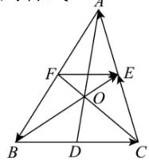

<!-- question-source:start -->
【20】如图, 在 $\triangle ABC$ 中, O 为重心, 点 D, E, F 分别是 BC, AC, AB 的中点, 化简下列各式:

(1) $\overrightarrow{BC} +\overrightarrow{CE} +\overrightarrow{EA}$ (2） $\overrightarrow{OE} +\overrightarrow{AB} +\overrightarrow{EA}$ （3） $\overrightarrow{AB} +\overrightarrow{FE} +\overrightarrow{DC}$

<!-- question-source:end -->

![[Q00004786A1]]
