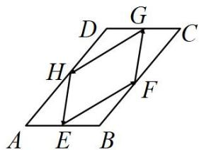

<!-- question-source:start -->
【6】(2023·全国高一)如图,平行四边形ABCD中,AB=1,AD=2,E,F,G,H分别是AB,BC,CD,AD边上的中点,则 $\overrightarrow{EF}\cdot\overrightarrow{FG}+\overrightarrow{GH}\cdot\overrightarrow{HE}=$ \_\_\_\_.

<!-- question-source:end -->

![[Q00005048A1]]
