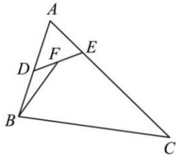

<!-- question-source:start -->
【7】（2022·江苏苏州高三统考）如图，在 $\Delta ABC$ 中，已知 AB = 4, AC = 6, $\angle BAC = 60^{\circ}$ ，点 D, E 分别在边 AB, AC 上，且 $\overrightarrow{AB} = 2\overrightarrow{AD}, \overrightarrow{AC} = 3\overrightarrow{AE}$ ，点 F 为 DE 中点，则 $\overrightarrow{BF} \cdot \overrightarrow{DE}$ 的值为 \_\_\_\_.

<!-- question-source:end -->

![[Q00005049A1]]
