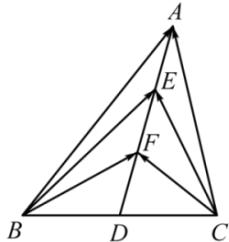

<!-- question-source:start -->
【8】(2023·全国高三专题)如图, 在 $\triangle ABC$ 中, 点 D 是 BC 的中点, E 、 F 是 AD 上的两个三等分点, $\overrightarrow{BA} \cdot \overrightarrow{CA} = 4$ , $\overrightarrow{BF} \cdot \overrightarrow{CF} = -1$ , 则 $\overrightarrow{BE} \cdot \overrightarrow{CE}$ 的值是 \_\_\_\_.

<!-- question-source:end -->

![[Q00005050A1]]
