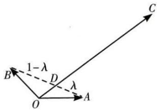

<!-- question-source:start -->
【26】如图, 平面内有三个向量 $\overrightarrow{OA}, \overrightarrow{OB}, \overrightarrow{OC}$ ，其中 $\overrightarrow{OA}$ 与 $\overrightarrow{OB}$ 的夹角为 $120^{\circ}, \overrightarrow{OA}$ 与 $\overrightarrow{OC}$ 的夹角为 $30^{\circ}$ ，且 $|\overrightarrow{OA}| = |\overrightarrow{OB}| = 1, |\overrightarrow{OC}| = 2\sqrt{3}$ 。若 $\overrightarrow{OC} = m\overrightarrow{OA} + n\overrightarrow{OB}$ ， $(m, n \in \mathbf{R})$ 则 $m + n$ 的值为 \_\_\_\_.

<!-- question-source:end -->

![[Q00005068A1]]
