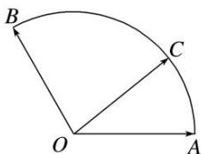

<!-- question-source:start -->
【28】给定两个长度为1的平面向量 $\overrightarrow{OA}$ 和 $\overrightarrow{OB}$ ，它们的夹角为 $\frac{2\pi}{3}$ ，如图所示，点 $C$ 在以 $O$ 为圆心的 $\widehat{AB}$ 上运动，若 $\overrightarrow{OC} = x\overrightarrow{OA} + y\overrightarrow{OB}(x, y \in \mathbf{R})$ ，则 $x + y$ 的取值范围是 \_\_\_\_.

<!-- question-source:end -->

![[Q00005070A1]]
