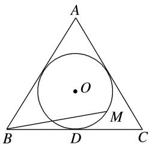

<!-- question-source:start -->
【35】如图, 圆 O 是边长为 $2\sqrt{3}$ 的等边 $\triangle ABC$ 的内切圆, 其与 BC 边相切于点 D, 点 M 为圆上任意一点, $\overrightarrow{BM}=x\overrightarrow{BA}+y\overrightarrow{BD}(x,y\in\mathbf{R})$ , 则 $2x+y$ 的最大值为 \_\_\_\_.

<!-- question-source:end -->

![[Q00005077A1]]
