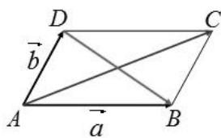
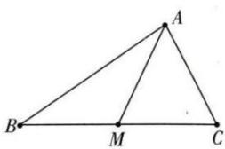

## 1. 极化恒等式及其推论：

（1）一般形式： $\vec{a}\cdot \vec{b} = \frac{1}{4}\left[\left(\vec{a} +\vec{b}\right)^2 -\left(\vec{a} -\vec{b}\right)^2\right]$

（2）公式推导： $\left.\begin{array}{l}\left(\vec{a} +\vec{b}\right)^2 = \vec{a}^2 +2\vec{a}\cdot \vec{b} +\vec{b}^2\\ \left(\vec{a} -\vec{b}\right)^2 = \vec{a}^2 -2\vec{a}\cdot \vec{b} +\vec{b}^2 \end{array}\right\} \Rightarrow \vec{a}\cdot \vec{b} = \frac{1}{4}\Big[\left(\vec{a} +\vec{b}\right)^2 -\left(\vec{a} -\vec{b}\right)^2\Big]$

（3）几何意义: 向量的数量积可以表示为以这组向量为邻

边的平行四边形的“和对角线”与“差对角线”平方差的 $\frac{1}{4}$ .

（4）三角形模式:如图,在 $\triangle ABC$ 中,M是BC的中点,则 $\overrightarrow{AB}\cdot\overrightarrow{AC}=\overrightarrow{AM^{2}}-\frac{1}{4}\overrightarrow{BC^{2}}$ .

