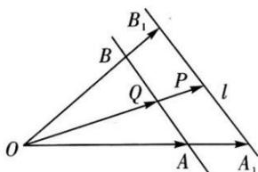

## 2. 等和线

平面内一组基底 $\overrightarrow{OA}, \overrightarrow{OB}$ 及任一向量 $\overrightarrow{OP}, \overrightarrow{OP} = \lambda \overrightarrow{OA} + \mu \overrightarrow{OB} (\lambda, \mu \in R)$ ，若点 P 在直线 AB 上或者在平行于 AB 的直线上，则 $\lambda + \mu = k$ （定值），反之也成立，我们把直线 AB 以及与直线 AB 平行的直线称为等和线.

①当等和线恰为直线 AB 时, k=1;

②当等和线在 O 点和直线 AB 之间时, $k \in (0,1)$ ;

③当直线 AB 在点 O 和等和线之间时, $k \in (1, +\infty)$ ;

④当等和线过 O 点时, k = 0 ;

⑤若两等和线关于 O 点对称, 则定值 k 互为相反数;

