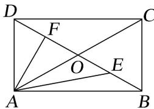

<!-- question-source:start -->
【2】（2024·全国高一专题）如图所示，在长方形ABCD中， $AB=4\sqrt{5},AD=8,E,O,F$ 为线段BD的四等分点，则 $\overrightarrow{AE}\cdot\overrightarrow{AF}=$ \_\_\_\_.

<!-- question-source:end -->

![[Q00009383A1]]
