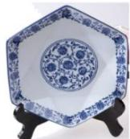
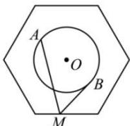

<!-- question-source:start -->
【16】（2024·广东深圳高一期中）图一是一个正六边形青花瓷盘，已知图二中正六边形的边长为2，圆O的圆心为正六边形的中心，半径为1，若点M在正六边形的边上运动，动点A，B在圆O上运动且关于圆心O对称，则 $\overrightarrow{MA}\cdot\overrightarrow{MB}$ 的取值范围是\_\_\_\_.

图一

图二
<!-- question-source:end -->

![[Q00009397A1]]
