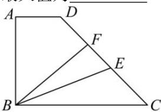

<!-- question-source:start -->
【22】（2024·全国高三专题）如图直角梯形 ABCD 中，EF 是 CD 边上长为 6 的可移动的线段，AD = 4， $AB = 8\sqrt{3}$ ，BC = 12，则 $\overrightarrow{BE} \cdot \overrightarrow{BF}$ 的最小值为 \_\_\_\_，最大值为 \_\_\_\_。

<!-- question-source:end -->

![[Q00009403A1]]
