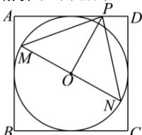

> [!faq]- 全练一本通解析
> **【答案】** $\left[0,\frac{1}{4}\right]$
>
> **【解析】**
> 如下图所示:
> 
> 设正方形 ABCD 的内切圆为圆 O，当弦 MN 的长度最大时，MN 为圆 O 的一条直径， $\overrightarrow{PM}\cdot\overrightarrow{PN}=\left(\overrightarrow{PO}+\overrightarrow{OM}\right)\cdot\left(\overrightarrow{PO}-\overrightarrow{OM}\right)=\left|\overrightarrow{PO}\right|^{2}-\left|\overrightarrow{OM}\right|^{2}=\left|\overrightarrow{PO}\right|^{2}-\frac{1}{4}$ 当 P 为正方形 ABCD 的某边的中点时， $\left|\overrightarrow{OP}\right|_{\min}=\frac{1}{2}$ 当 P 与正方形 ABCD 的顶点重合时， $\left|\overrightarrow{OP}\right|_{\max}=\frac{\sqrt{2}}{2}$ ，即 $\frac{1}{2}\leq\left|\overrightarrow{OP}\right|\leq\frac{\sqrt{2}}{2}$ ，
> 因此， $\overrightarrow{PM}\cdot\overrightarrow{PN}=\left|\overrightarrow{PO}\right|^{2}-\frac{1}{4}\in\left[0,\frac{1}{4}\right]$ . 故答案为： $\left[0,\frac{1}{4}\right]$ .
