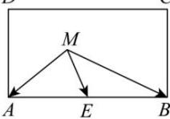

> [!faq]- 全练一本通解析
> **【答案】** 5
>
> **【解析】**
> 设 AB 的中点为 E，连接 ME，
> 则 $\overrightarrow{MA}\cdot\overrightarrow{MB}=\left(\overrightarrow{ME}+\overrightarrow{EA}\right)\cdot\left(\overrightarrow{ME}+\overrightarrow{EB}\right)$ $=\left|\overrightarrow{ME}\right|^{2}-\left|\overrightarrow{EB}\right|^{2}=\left|\overrightarrow{ME}\right|^{2}-4.$ ∵ 点点 M 是矩形 ABCD 内（包括边界）一动点，且 $\left|CE\right|=\sqrt{\left|EB\right|^{2}+\left|BC\right|^{2}}=\sqrt{4+5}=3$ ∴ $\left|\overrightarrow{ME}\right| \in [0,3]$ ，则 $\overrightarrow{MA} \cdot \overrightarrow{MB} \in [-4,5]$ ，当点 M 与 D 点或 C 点重合时，取得最大值 5. 故答案为:5.
> D C
> 
